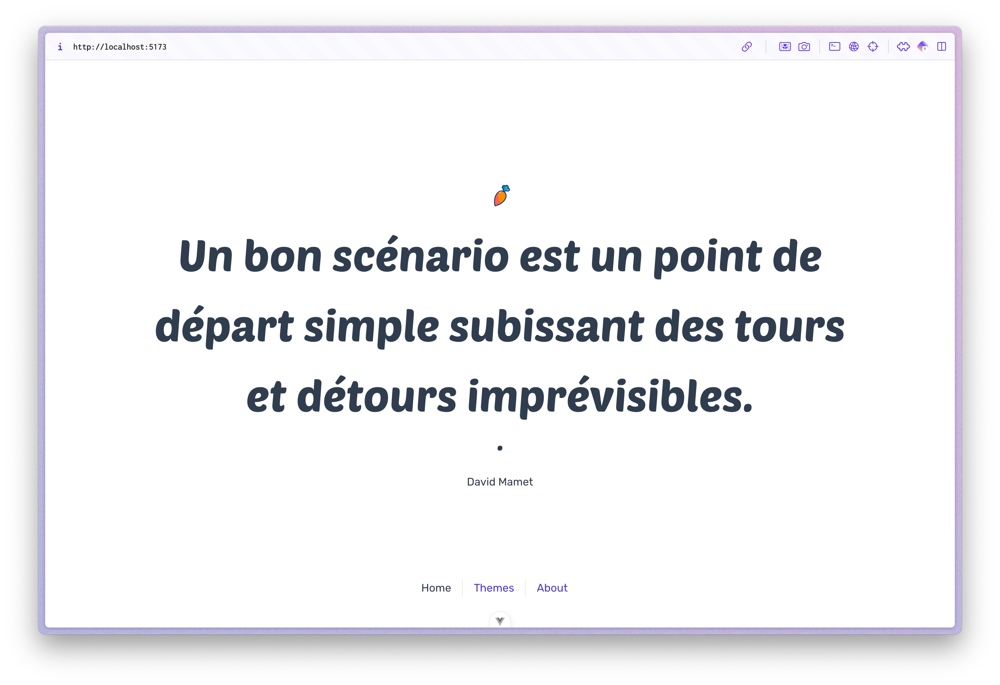

# kwotes • django vue

This is a tiny project demonstrating the usage of Django & Vue.js to retrieve an display quotes in a browser.

## Quickstart

Prerequisites: You should have python 3.11+ and django installed.

* Clone this repo: `git clone https://github.com/rootasjey/kwotes-django-vue`
* `cd kwotes-django-vue`
* Run Django backend with:
  * `cd backend`
  * `python manage.py runserver`
* Run Vue.js frontend with:
  * `cd frontend`
  * `npm run dev` (or `bun dev`)
